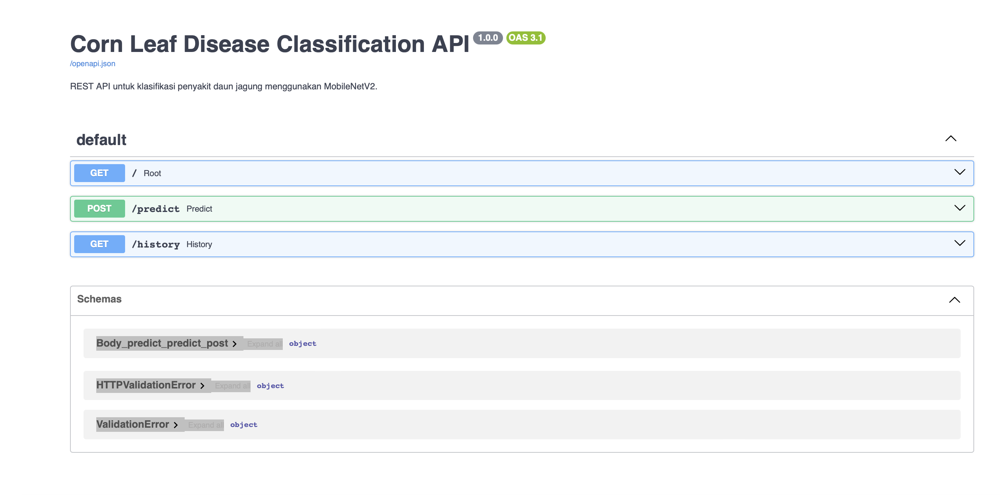
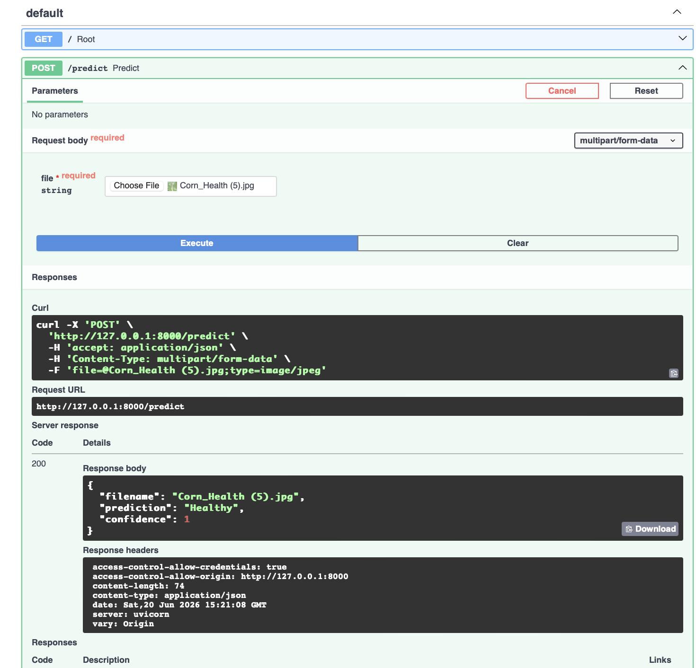
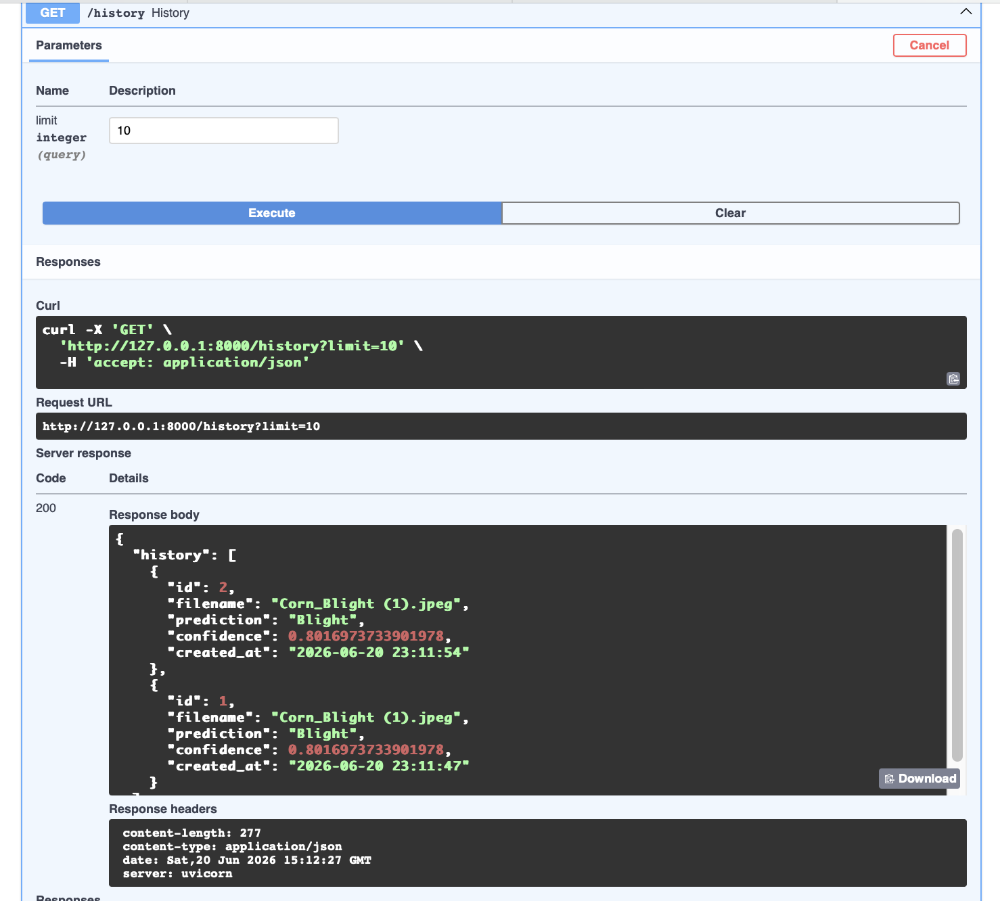
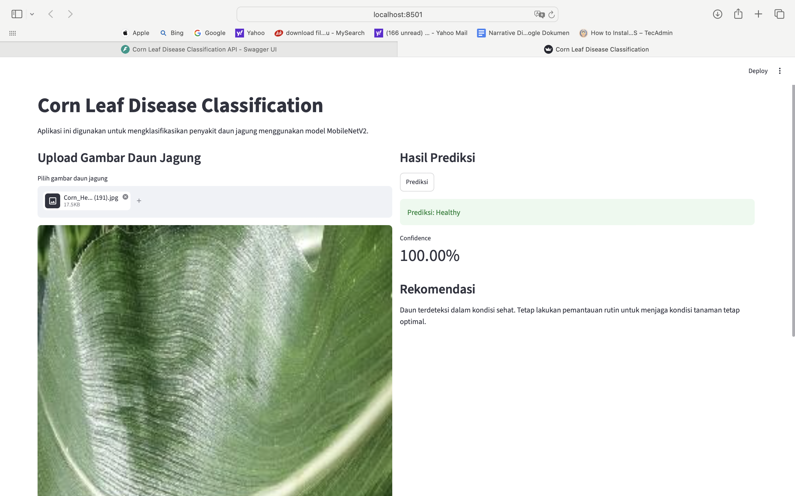
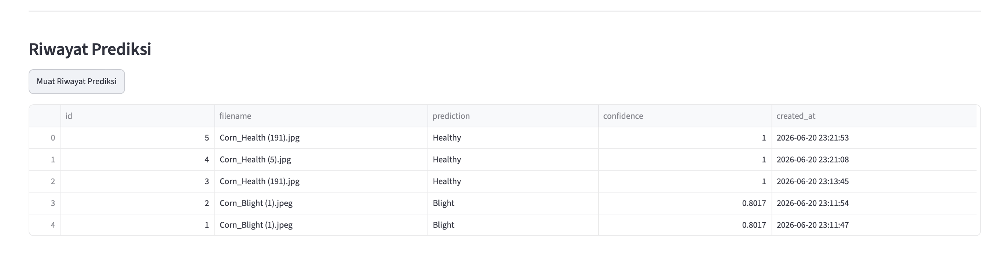

# Klasifikasi Penyakit Daun Jagung Menggunakan MobileNetV2

Project ini merupakan sistem klasifikasi citra daun jagung berbasis deep learning. Model digunakan untuk mengklasifikasikan gambar daun jagung ke dalam empat kelas, yaitu Blight, Common Rust, Gray Leaf Spot, dan Healthy.

Project ini menggunakan arsitektur MobileNetV2 dengan pendekatan transfer learning. Model yang telah dilatih kemudian diintegrasikan ke dalam REST API menggunakan FastAPI dan antarmuka web menggunakan Streamlit.

## Ringkasan Project

Tujuan utama project ini adalah membangun sistem deep learning end-to-end untuk membantu proses identifikasi penyakit daun jagung berdasarkan gambar. Pengguna dapat mengunggah gambar daun jagung melalui aplikasi Streamlit, kemudian sistem akan menampilkan hasil prediksi beserta confidence score.

Project ini mencakup beberapa tahapan utama:

* Preprocessing dan augmentasi data gambar
* Pelatihan model menggunakan MobileNetV2
* Evaluasi model menggunakan metrik klasifikasi
* Deployment model menggunakan FastAPI
* Penyimpanan riwayat prediksi menggunakan SQLite
* Pembuatan antarmuka pengguna menggunakan Streamlit
* Pipeline CI menggunakan GitHub Actions

## Dataset

Dataset yang digunakan adalah Corn or Maize Leaf Disease Dataset. Dataset ini terdiri dari empat kelas citra daun jagung.

| Kelas          | Jumlah Gambar |
| -------------- | ------------: |
| Common Rust    |         1.306 |
| Gray Leaf Spot |           574 |
| Blight         |         1.146 |
| Healthy        |         1.162 |
| **Total**      |     **4.188** |

Dataset ini dibangun dari kombinasi dataset PlantVillage dan PlantDoc. Beberapa gambar yang kurang relevan telah dihapus selama proses pembentukan dataset.

## Model

Model yang digunakan adalah MobileNetV2 dengan pendekatan transfer learning. MobileNetV2 dipilih karena memiliki arsitektur yang ringan, efisien, dan sesuai untuk tugas klasifikasi gambar.

Alur umum model:

```text
Input gambar
→ Resize ke 224x224 piksel
→ Preprocessing MobileNetV2
→ Ekstraksi fitur menggunakan MobileNetV2
→ Classification head
→ Output softmax
```

Model menghasilkan prediksi ke salah satu kelas berikut:

```text
Blight
Common_Rust
Gray_Leaf_Spot
Healthy
```

## Struktur Project

```text
DeepLearning/
├── api/
│   ├── main.py
│   └── database.py
│
├── assets/
│   ├── fastapi-docs.png
│   ├── fastapi-history.png
│   ├── fastapi-predict.png
│   ├── streamlit-prediction.png
│   └── streamlit-history.png
│
├── database/
│   └── .gitkeep
│
├── model/
│   ├── corn_leaf_mobilenetv2.keras
│   └── class_names.json
│
├── .github/
│   └── workflows/
│       └── ci.yml
│
├── streamlit_app.py
├── requirements.txt
├── .gitignore
└── README.md
```

## API Endpoint

REST API dibuat menggunakan FastAPI dan memiliki endpoint berikut:

| Method | Endpoint   | Keterangan                                       |
| ------ | ---------- | ------------------------------------------------ |
| GET    | `/`        | Mengecek status API                              |
| POST   | `/predict` | Mengunggah gambar dan mendapatkan hasil prediksi |
| GET    | `/history` | Menampilkan riwayat prediksi dari database       |

Contoh response dari endpoint `/predict`:

```json
{
  "filename": "corn_leaf.jpg",
  "prediction": "Healthy",
  "confidence": 1.0
}
```

## Hasil Implementasi

### Dokumentasi FastAPI

REST API dapat diakses melalui Swagger UI. Pada halaman ini tersedia endpoint utama yang digunakan dalam sistem, yaitu `/`, `/predict`, dan `/history`.



### Pengujian Endpoint `/predict`

Endpoint `/predict` digunakan untuk menerima input berupa gambar daun jagung. Setelah gambar diunggah, API melakukan preprocessing gambar, menjalankan model MobileNetV2, dan mengembalikan hasil prediksi beserta confidence score.



### Pengujian Endpoint `/history`

Endpoint `/history` digunakan untuk menampilkan riwayat prediksi yang tersimpan di database SQLite. Data yang ditampilkan meliputi nama file, hasil prediksi, confidence score, dan waktu prediksi.



### Tampilan Streamlit

Aplikasi Streamlit digunakan sebagai antarmuka pengguna untuk mengunggah gambar daun jagung dan menampilkan hasil prediksi secara langsung.



### Riwayat Prediksi pada Streamlit

Selain menampilkan hasil prediksi, aplikasi Streamlit juga menyediakan fitur untuk melihat riwayat prediksi yang diambil dari database melalui API.



## Instalasi

Clone repository:

```bash
git clone https://github.com/AnantaWijaya14/DeepLearning-DeepLearning-Corn-Leaf-Disease.git
cd DeepLearning-DeepLearning-Corn-Leaf-Disease
```

Buat dan aktifkan virtual environment:

```bash
python -m venv .venv
source .venv/bin/activate
```

Install seluruh dependencies:

```bash
pip install -r requirements.txt
```

## Menjalankan FastAPI

Jalankan server FastAPI:

```bash
python -m uvicorn api.main:app --reload
```

Dokumentasi API dapat diakses melalui:

```text
http://127.0.0.1:8000/docs
```

FastAPI harus dijalankan terlebih dahulu sebelum menjalankan aplikasi Streamlit.

## Menjalankan Streamlit

Buka terminal baru, lalu jalankan:

```bash
streamlit run streamlit_app.py
```

Aplikasi Streamlit dapat diakses melalui:

```text
http://localhost:8501
```

## Database

Project ini menggunakan SQLite untuk menyimpan riwayat hasil prediksi. File database akan dibuat secara otomatis ketika API dijalankan dan pengguna melakukan prediksi.

Data yang disimpan meliputi:

* Nama file gambar
* Hasil prediksi
* Confidence score
* Waktu prediksi

## CI Pipeline

Project ini dilengkapi dengan pipeline CI menggunakan GitHub Actions. File konfigurasi workflow berada pada:

```text
.github/workflows/ci.yml
```

Pipeline berjalan secara otomatis ketika terdapat push atau pull request ke branch `main`. Proses yang dilakukan meliputi instalasi dependencies dan pengecekan syntax Python pada file API dan Streamlit.

## Referensi

[1] P. Bachhal, V. Kukreja, and S. Ahuja, “Maize Disease Classification using Deep Learning Techniques: A Review,” in *2023 International Conference on Advancement in Computation & Computer Technologies (InCACCT)*, 2023, pp. 259–264, doi: 10.1109/InCACCT57535.2023.10141847.

[2] H. Amin, A. Darwish, A. E. Hassanien, and M. Soliman, “End-to-End Deep Learning Model for Corn Leaf Disease Classification,” *IEEE Access*, vol. 10, pp. 31103–31115, 2022, doi: 10.1109/ACCESS.2022.3159678.

[3] M. Sandler, A. Howard, M. Zhu, A. Zhmoginov, and L.-C. Chen, “MobileNetV2: Inverted Residuals and Linear Bottlenecks,” in *2018 IEEE/CVF Conference on Computer Vision and Pattern Recognition (CVPR)*, 2018, pp. 4510–4520, doi: 10.1109/CVPR.2018.00474.

[4] D. Singh, N. Jain, P. Jain, P. Kayal, S. Kumawat, and N. Batra, “PlantDoc: A Dataset for Visual Plant Disease Detection,” in *Proceedings of the 7th ACM IKDD CoDS and 25th COMAD*, 2020, pp. 249–253.

[5] J. Arun Pandian and G. Gopal, “Data for: Identification of Plant Leaf Diseases Using a 9-layer Deep Convolutional Neural Network,” *Mendeley Data*, V1, 2019, doi: 10.17632/tywbtsjrjv.1.
